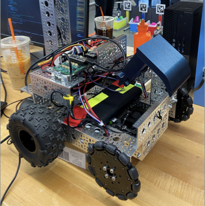
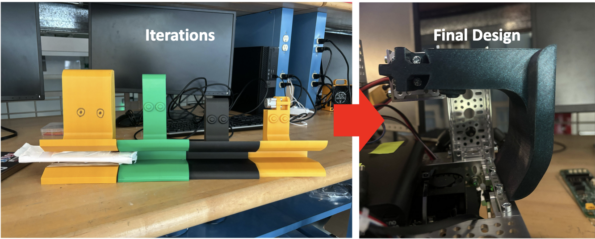
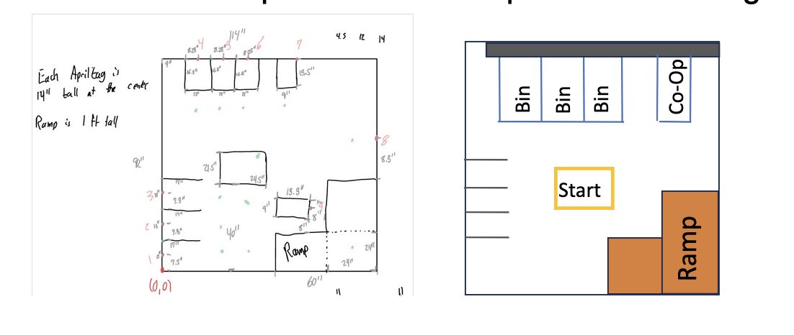
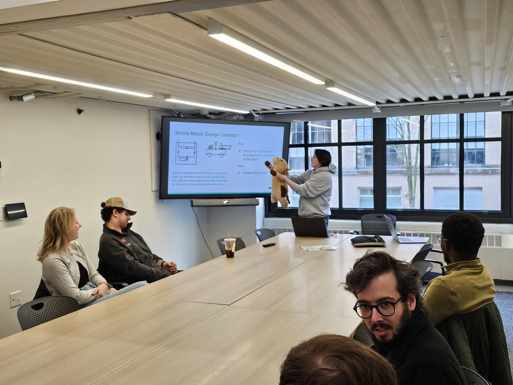

# MIT 2.12 Final Project – Autonomous Bin Retrieval Robot

  

This repository contains the full codebase and assets for our final project in MIT's 2.12: Introduction to Robotics. The goal of the competition was to build an autonomous robot capable of retrieving and placing color-coded bins within a structured arena using vision, navigation, and actuation.

---

## System Overview

Our robot is a two-wheeled, rear-powered platform equipped with an end-effector for bin manipulation. It autonomously navigates to designated bins, detects their color using vision, and transports them to target locations.

Key capabilities:

* AprilTag-based localization and mapping
* Sensor fusion with wheel encoders, IMU, and ToF sensors
* Vision-based bin classification
* Wireless communication between Jetson and ESP32 microcontroller for manual override
* Bin retrieval using a custom end-effector driven by a high-torque servo

---

## Hardware Design

* **Drive System**:
  Two-wheel, rear-powered differential drive with front caster wheels for stability.

* **End Effector**:
  Designed to scoop bins and drag them across the field. Powered by a 60 RPM servo to maximize torque while maintaining low speed for stability.

  

    
  

* **Sensors**:

  * Front-facing calibrated camera for vision and AprilTag detection
  * Time-of-flight (ToF) sensors for obstacle detection and wall following
  * IMU and wheel encoders for pose estimation and odometry

* **Compute**:

  * Jetson Nano for high-level navigation, vision processing, and behavior control
  * ESP32 for low-level motor control, sensor polling, and real-time actuation

* **Wireless Control**:
  We implemented a custom communication layer using ESP-NOW. Instead of a wired joystick, keyboard commands were transmitted wirelessly to the ESP32 from the Jetson for debugging and teleoperation.

---

## Software Architecture

The robot software stack is split between two main components:

* **High-Level (Jetson)**:
  Responsible for localization, behavior planning, perception, and commanding the low-level subsystem. Written in Python using OpenCV and numpy-based pose estimation.

* **Low-Level (ESP32)**:
  Written using PlatformIO and C++, the low-level handles PWM motor control, servo updates, and synchronous sensor readings. A robust packet protocol ensures reliable wireless coordination with the Jetson.

> PlatformIO allowed us to modularize low-level motor control, sensors, and wireless logic, making development faster and debugging easier across multiple test files.

---

## Implementation Notes

Due to time constraints in the final weeks, the robot was primarily operated using a semi-autonomous control strategy:

* **Target acquisition** was executed using AprilTag localization and bin detection (`targetTest.py`).
* **Bin pickup** was robust, thanks to our final mechanical end-effector design (see videos below).
* **Bin placement** was implemented during the final days of competition but the code was unfortunately lost due to it being uncommitted to Github from the Jetson Nano.

  

---

## Demo Videos

| Bin Grab                         | Bin Placement                     |
| -------------------------------- | --------------------------------- |
| [Watch Here](assets/binGrab.MP4) | [Watch Here](assets/binPlace.MP4) |

---

## Team & Contributions

This robot was developed by a team of 5 students. My primary role was:

* Architecting and writing the low-level control code (motor drivers, encoders, wireless protocol)
* Integrating and debugging communication between Jetson and ESP32
* Assisting in end-to-end system validation and test planning

I also worked closely with our high-level lead to test sensor fusion and refine vision-based feedback loops during bin tracking and pickup.

---

## Lessons & Reflection

This project demanded rapid iteration across electrical, mechanical, and software subsystems. While the full state machine was not finalized, our robot was able to reliably identify, retrieve, and begin placing bins under guided control. With more time, we would have extended the autonomous logic and finalized full bin placement strategies.

> Designing robust modular code and clear debug tools proved invaluable across such a time-constrained integration effort.

---

## Fun Pictures

   
  <em>Me running the robot's software during competition with my team.</em>

 

   
  <em>Me presenting our design during a design review in class with my favorite stuffed animal.</em>

